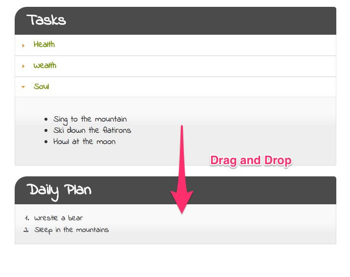

## jQuery UI && Ajax

A client has come to your with an idea for a to-do list application that consists of repeatable 'tasks' that you do on a weekly basis. These tasks are categorized into three different categories: health, wealth, and soul. The app should allow you to drag-and-drop these tasks into an ordered list inside of a daily plan, so that the user can prioritize what they need to get done.

The application will request these tasks from the server, load them on the client side (in accordance to their categories), and provide the functionality to drag each item in the daily list.

This project will utilize a number of [jQuery UI](https://jqueryui.com/) components to build an interactive interface.

## Setup

1. JScript front end
  * cd into `js`
  * `http-server`
1. Rails API
  * cd into `tasks_app`
  * `bundle`
  * `rake db:create`
  * `rails s`

### Iteration One | Accordions

Create markup that consists of a section for loading tasks from the database, and another section that will hold the list of tasks for the day. There should be three different categories for the tasks, and they should have headers that function as [accordions](https://jqueryui.com/accordion/).

### Iteration Two | Drag-and-Drop

With hard-coded list items, build the functionality to drag a 'task' into the 'daily plan'. You should be using the [droppable](http://jqueryui.com/droppable/#shopping-cart) documentation to help you get started. A task should get dropped into an [ordered list](https://developer.mozilla.org/en-US/docs/Web/HTML/Element/ol).

### Iteration Three | Sortable

Make the daily plan's task list [sortable](https://jqueryui.com/sortable/), so the user can prioritize which task will go first.

### Iteration Four | Server Side

At this point, you should have a hard-coded MVP of the application. You should be able to drag and drop hard coded list items into a daily plan.

Switch over to the rails side of this repository and create a `Task` model that has `category`, and `description` attributes. The category will map to the panel headers, and the description will map to the task itself.

Add multiple tasks using the rails console. Make sure you have multiple tasks for each category.

Then, create an endpoint which will return all of the tasks stored in the database when requested with ajax.

### Iteration Five | Ajax

Back to the client side, now, use [ajax](http://api.jquery.com/jquery.ajax/) to request the tasks from the server side. Place each task into the DOM and into the appropriate category using the correct markup for the features above. Be sure to remove the hard-coded tasks as well.
